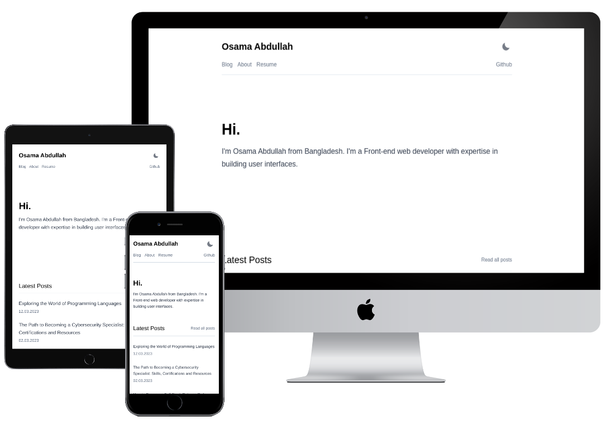

## Why I Built This Project

I built this project to provide a starting point for GatsbyJS projects that use Markdown for content. Markdown is a popular markup language that makes it easy to write content that's both human-readable and machine-readable. With this project, you can get up and running quickly with a GatsbyJS project that's set up to use Markdown.

## Screenshots of UI



## Technology

- **GatsbyJS:** a framework for building static websites with ReactJS
- **ReactJS:** a JavaScript library for building user interfaces
- **MDX:** a format that allows you to write JSX (a syntax extension for JavaScript that allows you to write HTML-like code in your JavaScript files) in Markdown documents
- **TypeScript:** a superset of JavaScript that adds static typing to the language, making it easier to catch bugs before they happen
- **GraphQL:** query data from API
- **gatsby-theme-minimal-blog v6.0.5:** A minimal blog theme by [LekoArts Lennart](https://github.com/LekoArts/gatsby-starter-minimal-blog)

To use this project, you'll need to have Node.js and npm (Node Package Manager) installed on your computer. Once you have those installed, you can run the following commands in your terminal:

```bash
npm install   // installs all the project dependencies listed in the package.json file
npm run develop   // starts the development server and opens the site in your browser
npm run build   // builds the site for production
npm run serve   // serves the production build of the site locally
npm run clean   // cleans the cache and public directories
```
That should get you up and running with this project!

## Project folder structured
```
portfolio-template/
  ├── static/ *images, *icons
  ├── content/
  │   ├── pages/
  │   │   ├── about/index.mdx
  │   │   └── resume/index.mdx
  │   └── posts/
  │       └── [post name]/index.mdx
  ├── src/
  │   ├── @lekoarts/
  │   │   └── gatsby-theme-minimal-blog/
  │   │       ├── bottom.mdx 
  │   │       └── hero.mdx
  │   └── pages/
  │       └── 404.js
  ├── .gitignore
  ├── gatsby-config.ts
  ├── LICENSE
  ├── tsconfig.json
  ├── npmrc
  ├── package.json
  └── README.md
```

## How to Use This Repo

To use this repository, simply clone it to your local machine and start customizing it to meet your needs. Here's a basic set of steps to get started:

1. **Clone the repository:** Use the `git clone` command to create a local copy of the repository on your computer.

```bash
git clone https://github.com/osama2kabdullah/portfolio-template.git
```

2. **Install the dependencies:** Use the `npm install` command to install the project's dependencies.

```bash
cd master
npm install
```

3. **Customize the project:** Use your preferred code editor to make changes to the project's files. You can customize the look and feel of the site, add new pages, and more.
4. **Run the development server:** Use the `npm start` command to start the GatsbyJS development server. This will compile your changes and make the site available at [http://localhost:8000/](http://localhost:8000/) and `http://192.168.x.x:8000/`.

```bash
npm start
```

5. **Build the site for production:** Use the `npm run build` command to build the site for production. This will create a set of static files that can be uploaded to a web server.

```bash
npm run build
```

That's it! With these steps, you should be able to get up and running quickly with a GatsbyJS project that uses Markdown for content. Happy coding!

## Contributing to this Project

Thanks for considering contributing to the GatsbyJS project! We welcome all types of contributions, from bug reports to feature requests to code changes. Here's how you can get started:

1. **Fork the repository:** This creates a copy of the project on your own GitHub account that you can make changes to.

```bash
git clone https://github.com/<your-username>/<repo-name>.git
```

2. **Clone your fork:** Use the `git clone` command to create a local copy of your fork on your computer.

```bash
git clone https://github.com/<your-username>/<repo-name>.git
```

3. **Make your changes:** This can involve writing code, updating documentation, or making other types of improvements.
4. **Test your changes:** Before submitting a pull request, make sure your changes work as expected.
5. **Submit a pull request:** Once you're confident your changes are ready, submit a pull request to the main GatsbyJS repository. We'll review your changes and provide feedback if necessary.

That's it! We appreciate all contributions to the project, no matter how big or small.
